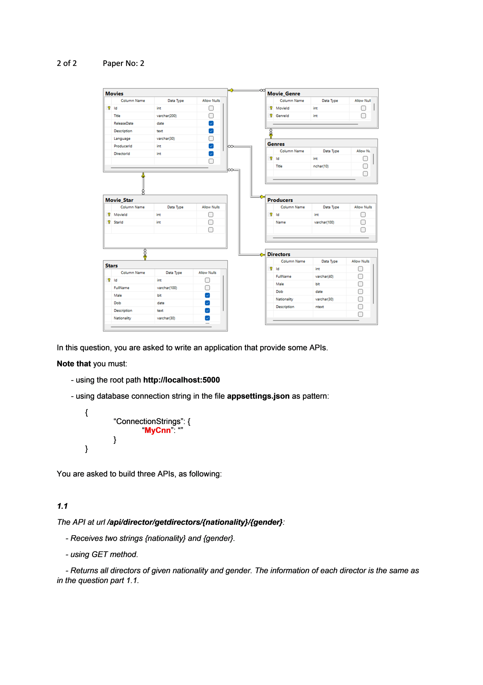
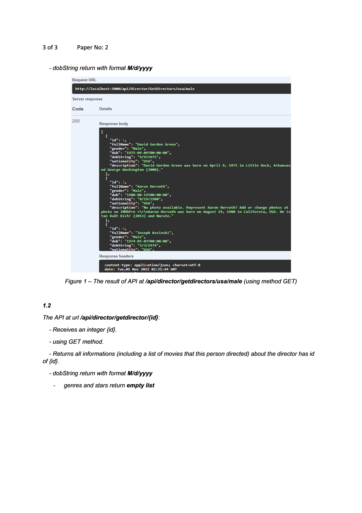
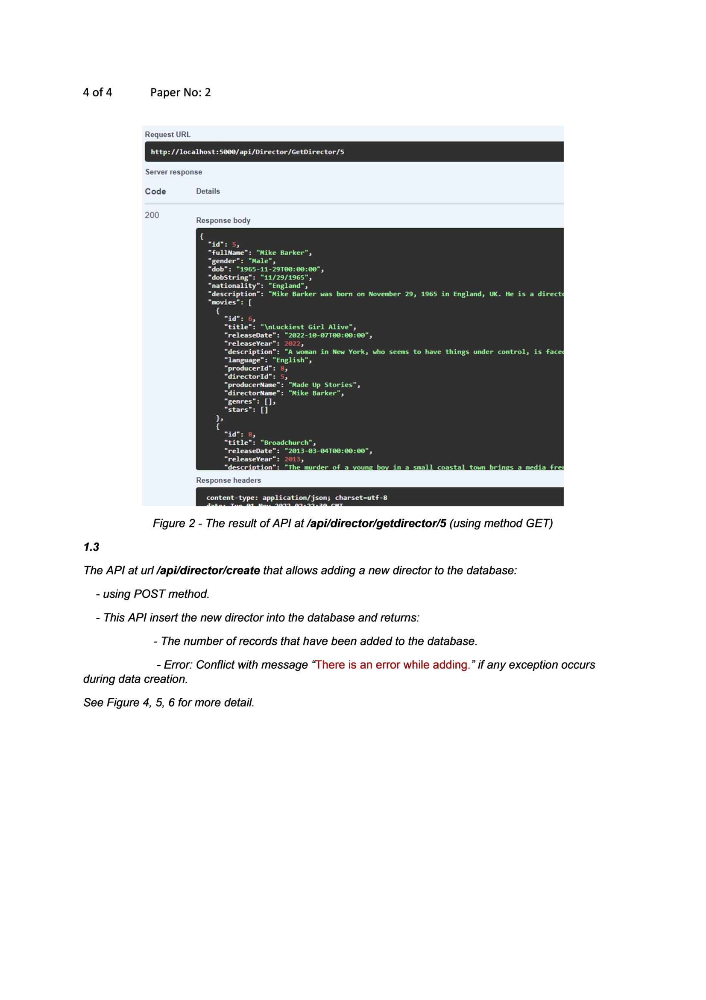
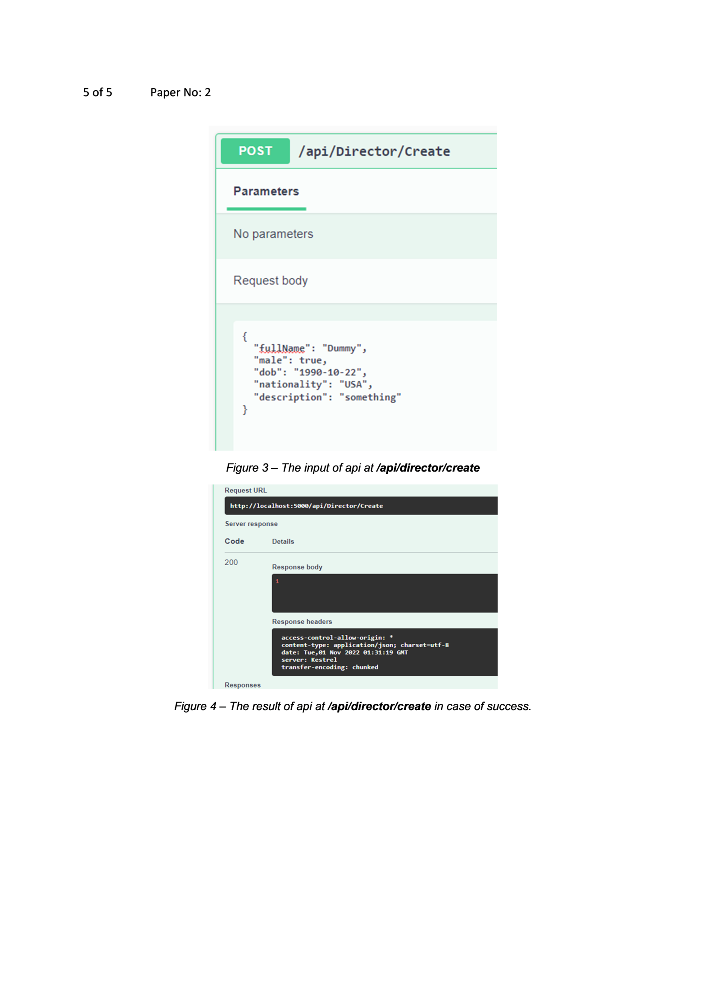
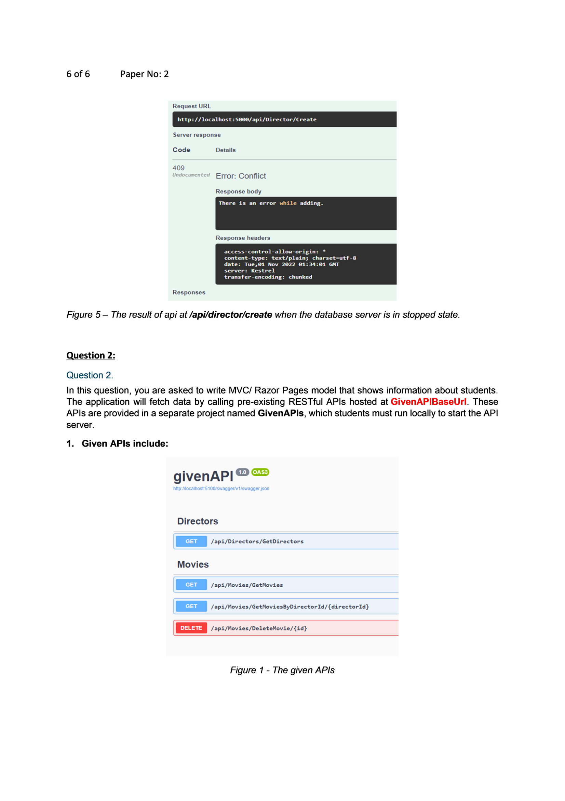

# Question 1 — Web API (Directors)

> Instructions chung của đề: xem [../README.md](../README.md)

Use the following database diagram for doing this exam.



**Bảng dữ liệu (theo diagram):**

| Table | Columns (Data Type, Allow Null) |
|---|---|
| **Movies** | Id (int, PK) · Title (varchar(200)) · ReleaseDate (date, null) · Description (text) · Language (varchar(30)) · ProducerId (int, null) · DirectorId (int, null) |
| **Movie_Genre** | MovieId (int, PK/FK) · GenreId (int, PK/FK) |
| **Genres** | Id (int, PK) · Title (nchar(10)) |
| **Movie_Star** | MovieId (int, PK/FK) · StarId (int, PK/FK) |
| **Stars** | Id (int, PK) · FullName (varchar(100)) · Male (bit) · Dob (date, null) · Description (text, null) · Nationality (varchar(30), null) |
| **Producers** | Id (int, PK) · Name (varchar(100)) |
| **Directors** | Id (int, PK) · FullName (varchar(40)) · Male (bit) · Dob (date) · Nationality (varchar(30)) · Description (ntext) |

**Quan hệ:** Movies 1—n Movie_Genre n—1 Genres; Movies 1—n Movie_Star n—1 Stars; Movies n—1 Producers; Movies n—1 Directors.

In this question, you are asked to write an application that provide some APIs.

**Note that you must:**
- using the root path `http://localhost:5000`
- using database connection string in the file `appsettings.json` as pattern:
  ```json
  {
    "ConnectionStrings": {
      "MyCnn": ""
    }
  }
  ```

You are asked to build three APIs, as following:

## 1.1

The API at url **`/api/director/getdirectors/{nationality}/{gender}`**:
- Receives two strings `{nationality}` and `{gender}`.
- using **GET** method.
- Returns all directors of given nationality and gender. The information of each director is the same as in question part 1.1.
- `dobString` return with format **M/d/yyyy**



*Figure 1 – The result of API at `/api/director/getdirectors/usa/male` (using method GET)*

Ví dụ response (`GET /api/Director/GetDirectors/usa/male`):
```json
[
  {
    "id": 1,
    "fullName": "David Gordon Green",
    "gender": "Male",
    "dob": "1975-04-09T00:00:00",
    "dobString": "4/9/1975",
    "nationality": "USA",
    "description": "David Gordon Green was born on April 9, 1975 in Little Rock, Arkansas..."
  },
  {
    "id": 2,
    "fullName": "Aaron Horvath",
    "gender": "Male",
    "dob": "1980-08-19T00:00:00",
    "dobString": "8/19/1980",
    "nationality": "USA",
    "description": "..."
  }
]
```

## 1.2

The API at url **`/api/director/getdirector/{id}`**:
- Receives an integer `{id}`.
- using **GET** method.
- Returns all informations (including a list of movies that this person directed) about the director has id of `{id}`.
- `dobString` return with format **M/d/yyyy**
- `genres` and `stars` return **empty list**



*Figure 2 - The result of API at `/api/director/getdirector/5` (using method GET)*

Ví dụ response (`GET /api/Director/GetDirector/5`):
```json
{
  "id": 5,
  "fullName": "Mike Barker",
  "gender": "Male",
  "dob": "1965-11-29T00:00:00",
  "dobString": "11/29/1965",
  "nationality": "England",
  "description": "Mike Barker was born on November 29, 1965 in England, UK. He is a director...",
  "movies": [
    {
      "id": 6,
      "title": "Luckiest Girl Alive",
      "releaseDate": "2022-10-07T00:00:00",
      "releaseYear": 2022,
      "description": "A woman in New York, who seems to have things under control, is faced...",
      "language": "English",
      "producerId": 8,
      "directorId": 5,
      "producerName": "Made Up Stories",
      "directorName": "Mike Barker",
      "genres": [],
      "stars": []
    },
    {
      "id": 8,
      "title": "Broadchurch",
      "releaseDate": "2013-03-04T00:00:00",
      "releaseYear": 2013,
      "description": "The murder of a young boy in a small coastal town brings a media frenzy..."
    }
  ]
}
```

## 1.3

The API at url **`/api/director/create`** that allows adding a new director to the database:
- using **POST** method.
- This API insert the new director into the database and returns:
  - The number of records that have been added to the database.
  - Error: **Conflict** with message **"There is an error while adding."** if any exception occurs during data creation.

See Figure 3, 4, 5 for more detail.



*Figure 3 – The input of api at `/api/director/create`*

Request body mẫu:
```json
{
  "fullName": "Dummy",
  "male": true,
  "dob": "1990-10-22",
  "nationality": "USA",
  "description": "something"
}
```

*Figure 4 – The result of api at `/api/director/create` in case of success* (response body: `1`, status 200)



*Figure 5 – The result of api at `/api/director/create` when the database server is in stopped state* (status **409 Conflict**, body: `There is an error while adding.`)
