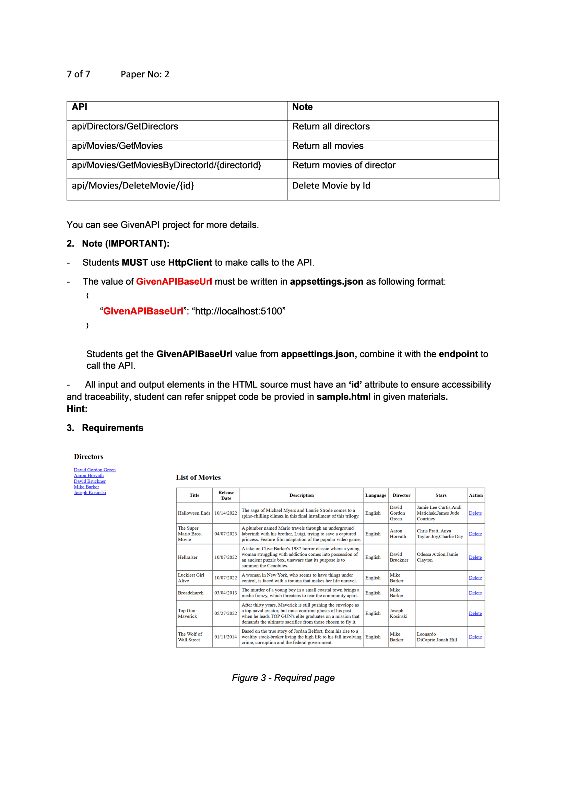
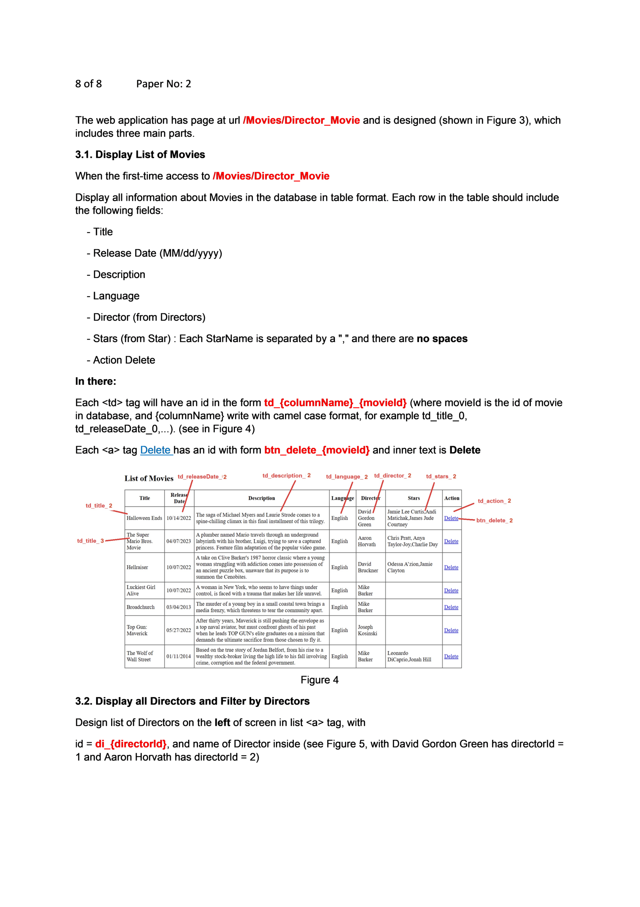
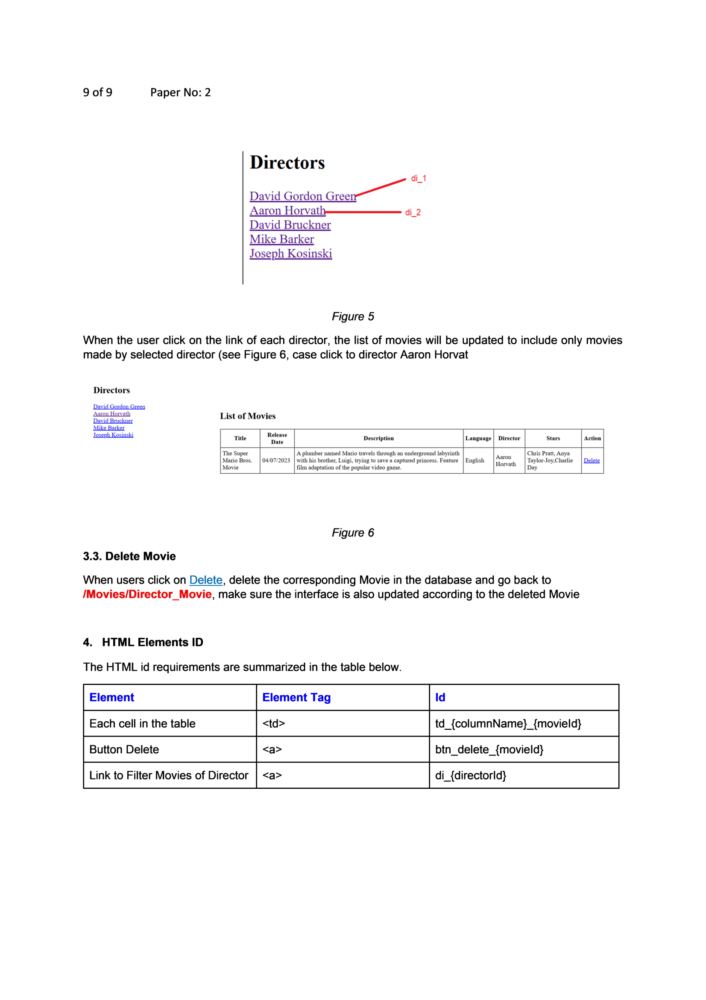

# Question 2 — MVC / Razor Pages (Movies by Director)

> Instructions chung của đề: xem [../README.md](../README.md)
> Phần đầu câu này nằm chung trang với cuối Question 1 — xem thêm [../Question_1/question_1.md](../Question_1/question_1.md)

In this question, you are asked to write MVC/ Razor Pages model that shows information about movies. The application will fetch data by calling pre-existing RESTful APIs hosted at **GivenAPIBaseUrl**. These APIs are provided in a separate project named **GivenAPIs**, which students must run locally to start the API server.

## 1. Given APIs include


*Figure 1 - The given APIs*

- `GET /api/Directors/GetDirectors`
- `GET /api/Movies/GetMovies`
- `GET /api/Movies/GetMoviesByDirectorId/{directorId}`
- `DELETE /api/Movies/DeleteMovie/{id}`

| API | Note |
|---|---|
| `api/Directors/GetDirectors` | Return all directors |
| `api/Movies/GetMovies` | Return all movies |
| `api/Movies/GetMoviesByDirectorId/{directorId}` | Return movies of director |
| `api/Movies/DeleteMovie/{id}` | Delete Movie by Id |

You can see GivenAPI project for more details.

## 2. Note (IMPORTANT)

- Students **MUST** use `HttpClient` to make calls to the API.
- The value of **GivenAPIBaseUrl** must be written in `appsettings.json` as following format:
  ```json
  {
    "GivenAPIBaseUrl": "http://localhost:5100"
  }
  ```
  Students get the `GivenAPIBaseUrl` value from `appsettings.json`, combine it with the endpoint to call the API.

- All input and output elements in the HTML source must have an **'id'** attribute to ensure accessibility and traceability, student can refer snippet code be provided in `sample.html` in given materials.

## 3. Requirements



*Figure 3 - Required page*

The web application has page at url **`/Movies/Director_Movie`** and is designed (shown in Figure 3), which includes three main parts.

### 3.1. Display List of Movies

When the first-time access to `/Movies/Director_Movie`

Display all information about Movies in the database in table format. Each row in the table should include the following fields:

- Title
- Release Date (MM/dd/yyyy)
- Description
- Language
- Director (from Directors)
- Stars (from Star): Each StarName is separated by a **","** and there are **no spaces**
- Action Delete

In there:
- Each `<td>` tag will have an id in the form **`td_{columnName}_{movieId}`** (where `movieId` is the id of movie in database, and `{columnName}` write with camel case format, for example `td_title_0`, `td_releaseDate_0`, ...). (see Figure 4)
- Each `<a>` tag Delete has an id with form **`btn_delete_{movieId}`** and inner text is `Delete`



*Figure 4*

### 3.2. Display all Directors and Filter by Directors

Design list of Directors on the **left** of screen in a list of `<a>` tags, with id = **`di_{directorId}`**, and name of Director inside (see Figure 5, with David Gordon Green has `directorId = 1` and Aaron Horvath has `directorId = 2`).



*Figure 5* — Directors list (left panel): David Gordon Green (`di_1`), Aaron Horvath (`di_2`), David Bruckner, Mike Barker, Joseph Kosinski.

When the user clicks on the link of each director, the list of movies will be updated to include only movies made by the selected director (see *Figure 6*, case click to director Aaron Horvath — shows only "The Super Mario Bros. Movie").

### 3.3. Delete Movie

When users click on **Delete**, delete the corresponding Movie in the database and go back to `/Movies/Director_Movie`, make sure the interface is also updated according to the deleted Movie.

## 4. HTML Elements ID

The HTML id requirements are summarized in the table below.

| Element | Element Tag | Id |
|---|---|---|
| Each cell in the table | `<td>` | `td_{columnName}_{movieId}` |
| Button Delete | `<a>` | `btn_delete_{movieId}` |
| Link to Filter Movies of Director | `<a>` | `di_{directorId}` |
